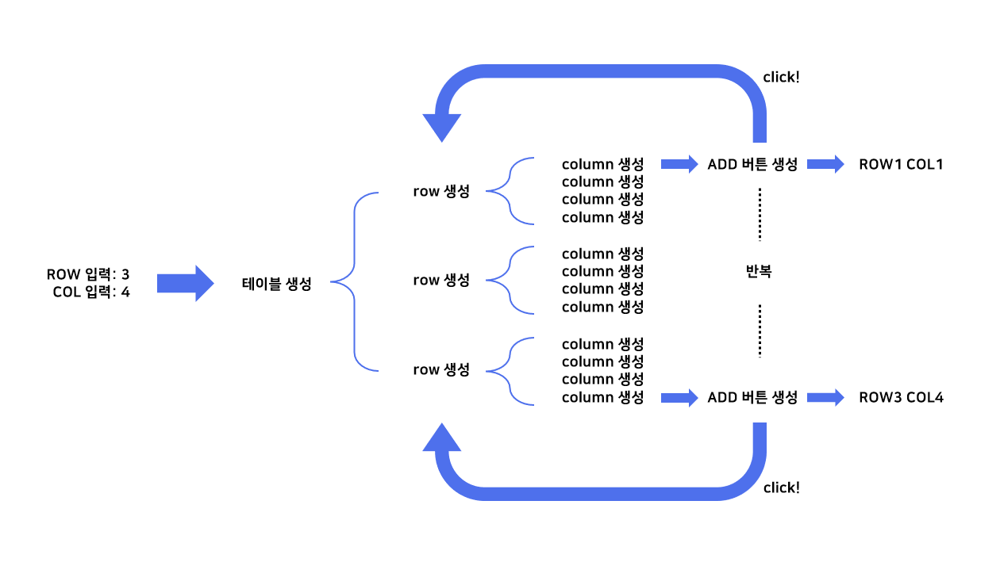

# WAVY TABLE
> 오락가락 끼릭까락 테이블

<p align="center">
    
</p>

## 문제🌒
사용자로부터 row와 column을 입력받아 테이블을 생성한다. 만약 3과 4를 입력받았다면 3행 4열의 테이블이 만들어진다. 각 테이블 셀에는 자기가 위치한 row와 column에 대한 정보가 표시되며, 그 옆에는 `ADD`라는 버튼이 있다. 이 버튼을 누르면 테이블에 row가 하나 추가된다. 추가된 row의 column 개수는 1에서 입력받은 column값까지 증감을 반복한다.

### 요구사항
- 추가된 row의 column 개수는 1부터 시작한다. 버튼을 누를 때마다 생성되는 column의 개수는 하나씩 늘어나며, 처음에 입력받은 column값까지 증가한다. (앞서 테이블 생성 시 column 값으로 4를 입력했기에 column은 최대 4개까지 생성) 최대치에 도달한 경우 생성되는 column 개수는 하나씩 줄어들고, 이 개수가 1이 되면 다시 하나씩 늘어난다. 어떤 `ADD` 버튼을 눌러도 <i>**똑같은 로직이 적용되어야 한다.**</i>
- `ADD` 버튼을 클릭하면 검은 배경에 흰 글씨로 변하고, 다시 클릭하면 원래 style로 돌아와야 한다.

## 해결 과정🌖
<p align="center">
    
</p>

학원에서 받은 숙제 중 하나로, 요구사항에 맞게 DOM을 동적으로 생성할 수 있는지를 물어보는 문제이다. 그러나 테이블 때문인지 이차원 배열의 활용 능력을 묻는 문제처럼 느껴졌다. 보통 테이블을 생성할 땐 중첩 for문을 돌린다. 외부 for문을 row 횟수 만큼 돌리고, 내부 for문을 column 횟수만큼 돌리면 원하는 크기의 테이블이 생성된다.
<br>

다만 여기서 포인트는 `ADD` 버튼을 누를 때 row는 하나가 추가되지만 그 안에 담긴 column의 개수는 증감을 반복한다는 점이다. <i>**그러기 위해선 row가 추가되었을 때, 모든 버튼이 추가된 row에서 생성된 column의 개수를 공유하고, 이 개수가 1인지 또는 처음에 입력받은 column값인지를 체크해야 한다.**</i>
<br>

```
let addition = -1;
let colCount = 1;

const updateColCount = (colSize) => {
    if (colCount == 1 || colCount == colSize) {
        addition *= -1;
    }
    colCount += addition;
};
```
```
const addRow = ((colSize) => {
    return function(event) {
        event.target.classList.toggle('color_inverted');

        const currentTable = event.target.parentElement.parentElement.parentElement;
        const extraRowSize = currentTable.childNodes.length;
        const newTr = document.createElement('tr');
        
        for (let currentCol = 0; currentCol < colCount; currentCol++) {
            newTr.appendChild(generateTd(extraRowSize, currentCol, colSize));
        }
        currentTable.appendChild(newTr);
        updateColCount(colSize);
    };
});
```
증감하는 column 개수를 기록하기 위해 전역변수 colCount를 선언했다. `updateColCount()` 메소드는 colCount가 +1씩 증가하다가 최대치 (매개변수 colSize로 테이블 생성 시 입력받은 column값이 대입될 예정)에 도달하면 다시 -1씩 줄이는 기능을 담당한다. 전역변수 colCount와 이 메소드를 이용해 추가된 row의 column 개수를 정한다. 
<br>

`addRow()` 메소드는 모든 `ADD` 버튼이 클릭될 때면 호출되는 메소드로, 버튼의 스타일을 바꾸고 새로운 row를 추가하는 기능을 수행한다. 이때 추가된 row의 column은 앞서 언급한 전역변수 colCount의 값만큼 생긴다. row가 추가되고 나면 `updateColCount()` 메소드를 호출해 colCount의 값을 업데이트한다.
<br>

만들다 보니 `addRow()` 메소드가 클로저임에도 전역변수에 의존하는 점이 아쉬웠다. 모든 `ADD` 버튼이 동일한 클로저를 사용한다면 colCount도 전역변수가 아니라 클로저의 지역변수로 설정해도 괜찮지 않을까 하고 시도해봤으나, 각각의 `ADD` 버튼이 colCount을 개별적으로 기록하여 원하는 결과가 나오지 않았다. 아쉽!
<br>